# Machine Learning Calcimetry Regression

## Problem Statement

A collection of 3068 images that looks like the following one is stored

</table> 
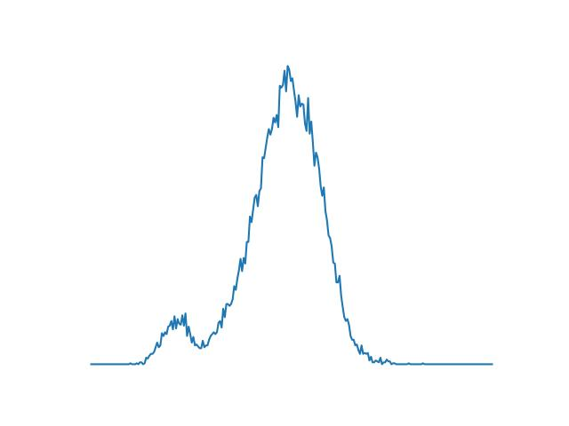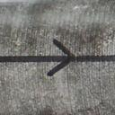
27 (479)

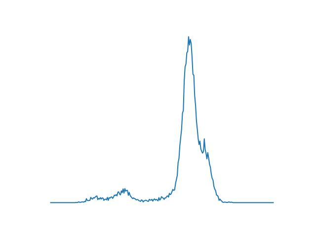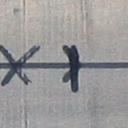
25 (2281)

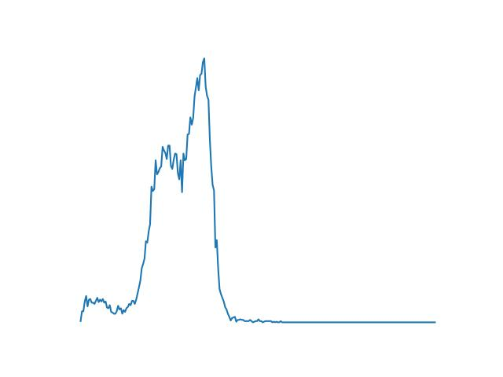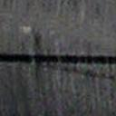
17 (1989)

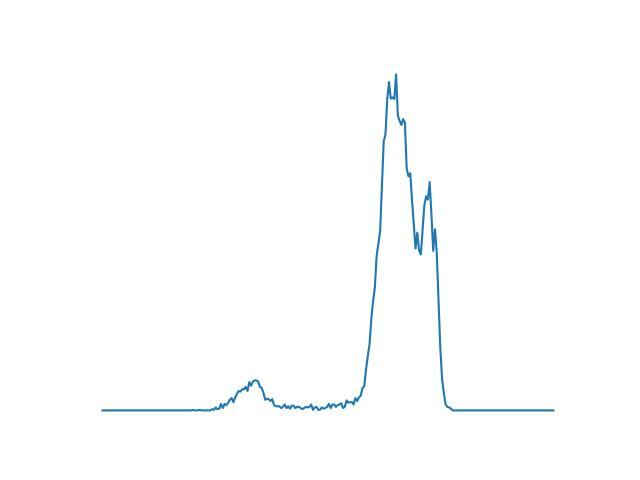
20 (624)

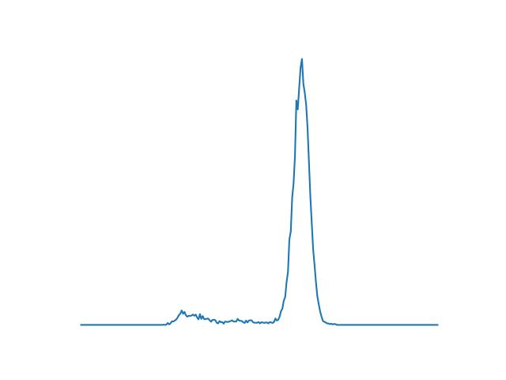
27 (1119)

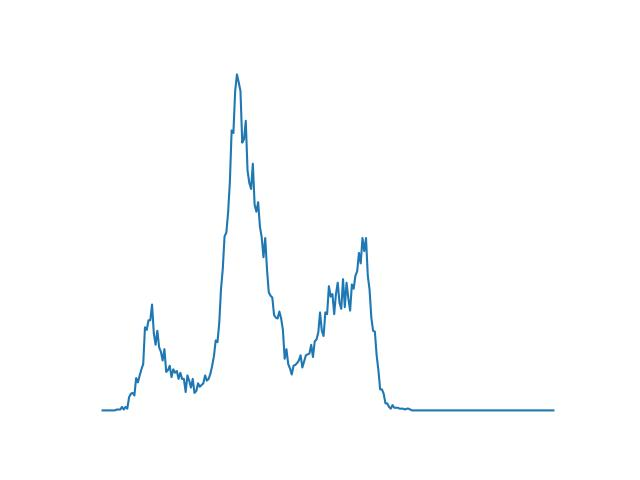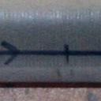
21 (1064)

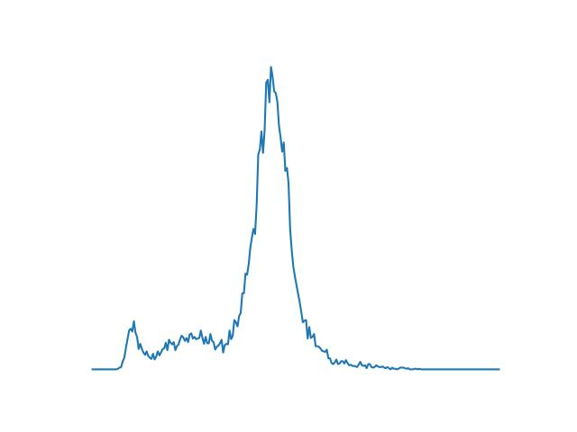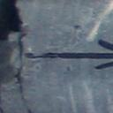
31 (1479)

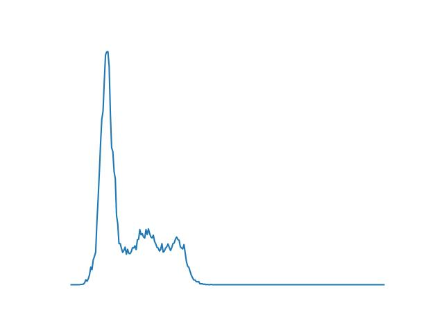
15 (2800)

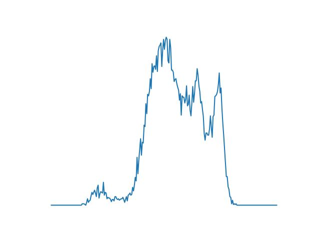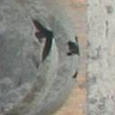
20 (347)

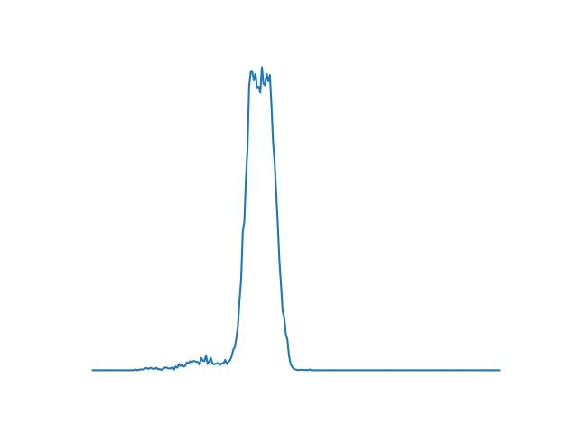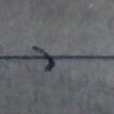
16 (19)

